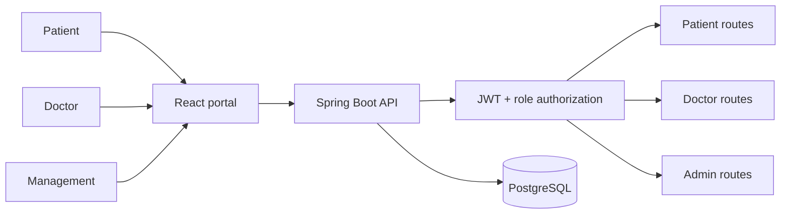

# CareConnect Patient Portal

[](https://github.com/sunilguntupalli/healthcare-patient-portal/actions/workflows/ci.yml)

A full-stack healthcare platform with separate patient, doctor, and management workspaces. It supports secure registration, appointments, profile management, clinical notes, medical records, and role-aware administration.

## Architecture



## Stack

- Java 17, Spring Boot 3, Spring Security, JWT, Bean Validation
- React 19, Vite, responsive CSS
- PostgreSQL 16
- Flyway migrations and Docker Compose

## Run with Docker

```bash
docker compose up --build
```

Open `http://localhost:5174`. The API is served at `http://localhost:8081/api`; PostgreSQL is available on `localhost:15432`.

## Demo credentials

After the API starts, each account opens its role-specific workspace:

| Workspace | Email | Password |
| --- | --- | --- |
| Patient portal | `patient@careconnect.dev` | `Password123!` |
| Doctor portal | `doctor@careconnect.dev` | `Doctor123!` |
| Management portal | `admin@careconnect.dev` | `Admin123!` |

## Local development

Start PostgreSQL using Docker, then run `mvn spring-boot:run` from `backend` and `npm install && npm run dev` from `frontend`.

The local development ports are frontend `5174`, API `8081`, and PostgreSQL `15432`. Override the backend CORS origin with `APP_CORS_ORIGIN` when using another frontend URL.

## Testing

```bash
cd backend && mvn test
cd ../frontend && npm run build
```

The backend suite uses an isolated H2 test database and verifies login roles, route authorization, and request validation. Production database changes are managed through versioned Flyway migrations in `backend/src/main/resources/db/migration`.

GitHub Actions runs the backend verification suite, builds the React application, and validates both container images for every push and pull request.

## Security notes

- Passwords are BCrypt-hashed and excluded from API serialization.
- JWT-authenticated routes are restricted by patient, doctor, and admin role.
- The bundled credentials and JWT secret are for local demonstration only; replace them before deployment.
